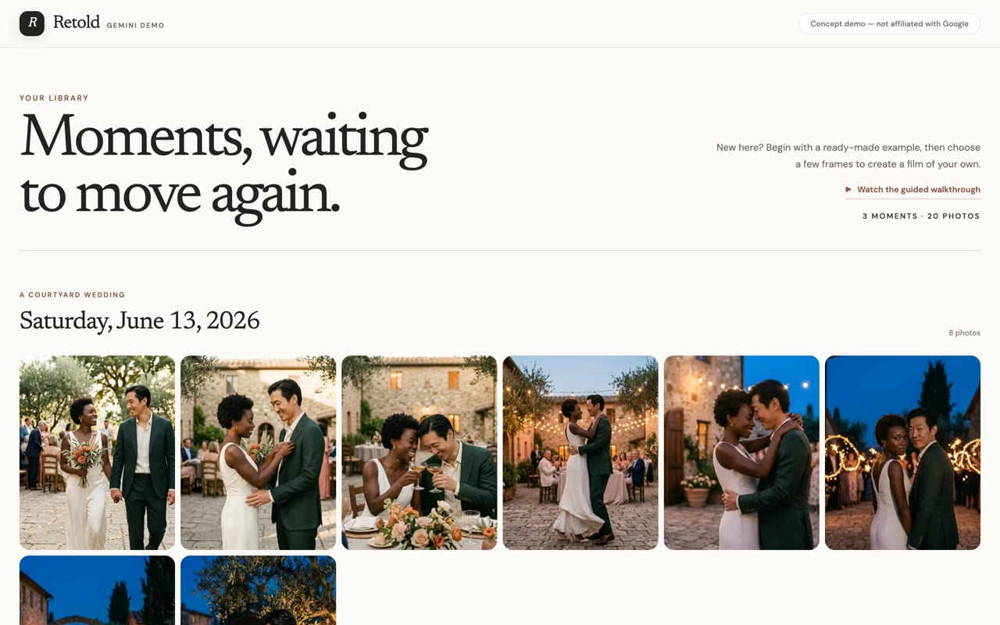
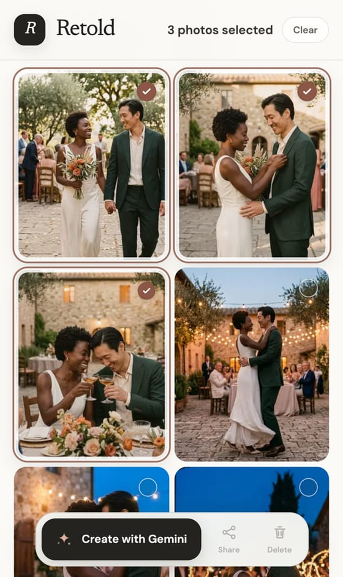
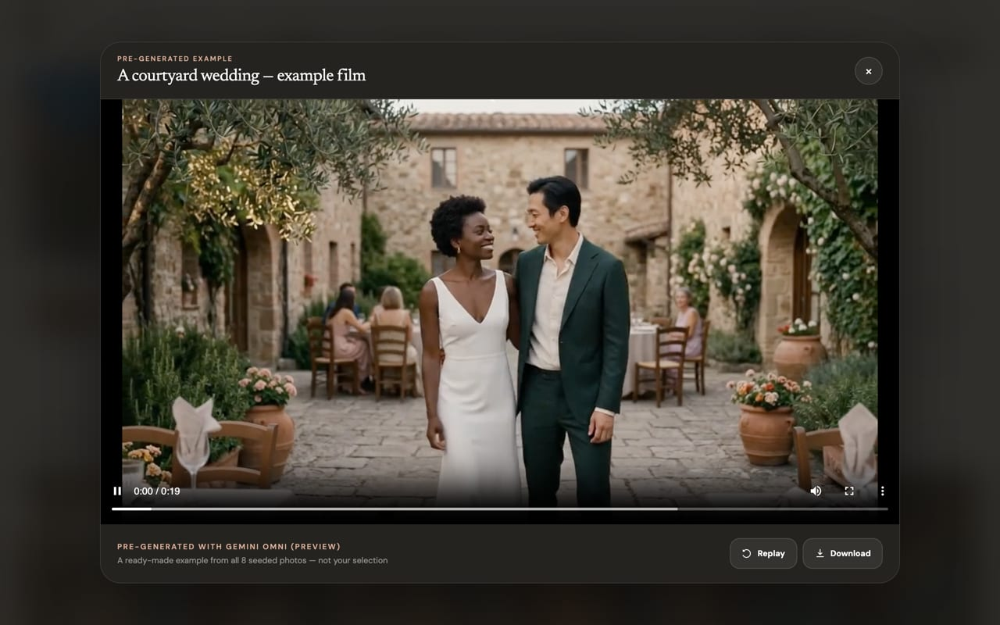

# Retold, a Gemini demo

*Gemini Omni × Google Photos: turning selected photos into film*

**A working prototype of a feature Google Photos doesn't have yet: select a handful of photos from your library, the same way you already multi-select to delete or share, tap one Gemini button, and get back a short generative film of that moment in your life.**

> **Live demo:** **[retold-gemini-demo.vercel.app](https://retold-gemini-demo.vercel.app)**
> **Status:** v0.1 shipped · [architecture doc](prototype_architecture.md)
>
> The demo is fully browsable by anyone — watch a showcase film, run the guided
> walkthrough, and explore the library. *Generating* a new film or camera roll
> runs on a paid model, so it's opened up per person; the whole experience short
> of live generation is free and unrestricted.



---

## The 15-second version

Google Photos can animate one photo into a 6-second clip (Photo to Video, Veo-powered). It can restyle one video (Video Remix, Gemini Omni-powered). It can stitch many photos into a non-generative slideshow with music (Highlight Videos). The next rung is missing: take the 30 photos you shot across a wedding night and turn them into one continuous, cinematic film. The kind of montage you'd see in a movie flashback, generated from your own real moments.

This is a live demo of that feature, built on `gemini-omni-flash-preview`, the same model family Google ships Video Remix on.

---

## Why Google would build this

*This section is the reasoning that led to the prototype.*

### Start from an uncomfortable question about Memories

The Memories feature is beloved, but ask honestly what the point of it is, for the user and for Google. For the user, it's a pleasant resurfacing of old photos. For Google, it increases user-minutes inside an app that has almost no natural value capture. There are no ads in Photos. Core editing and organizing features can't be paywalled, because the expectation for a default photos app is that the normal features are free, and breaking that expectation would do real brand damage. Also, minutes spent in Photos are minutes *not* spent on surfaces that do capture value.

So Memories, as it stands, is an **engagement layer driving toward a conversion layer that doesn't really exist yet** — and the conversion layer is the interesting design problem. Working forward from that:

1. **Photos' baseline features must stay free.** That's the contract with the user, and Google has honored it (Magic Eraser, Unblur, and Portrait Light all went free in 2024).
2. **So the conversion layer has to be a category users already expect and tolerate paying for.** You can't invent a new tolerance, you have to borrow an existing one.
3. **Generative AI is that category.** People in 2026 already pay monthly for generative tools. Charging for expensive, novel generation doesn't break the "Photos is free" contract. It sits on top of it, priced by the compute rather than by holding basic utility hostage.

The feature that fills this slot needs to satisfy two conditions at once: **(A)** deliver value to the user genuinely beyond what they expect from a photos app by default, and **(B)** capture value for Google without violating the free-app contract.

### Google is already running this playbook

Checking the reasoning against what Google actually ships:

- **Photo to Video** (July 2025, upgraded to Veo 3 that September): free with daily caps, higher caps for AI Pro/Ultra subscribers. Single photo in, 6-second clip out.
- **Video Remix** (July 8, 2026): Gemini Omni-powered video restyling, and the first Photos feature gated entirely to paid AI tiers. Compute-cost monetization, layered on top of the storage-tier base that already drives 150M+ Google One subscribers.
- The paywall line is still being tuned in both directions (personalized image generation went free in June 2026, Video Remix went paid-only nine days later).

The ladder is visible: **one photo → one video** (shipped), **one video → restyled video** (shipped, paywalled), **many photos → one film** (missing). The missing rung is also the most emotionally valuable one.

### The feature, in one paragraph

Inside Google Photos, the user multi-selects photos exactly as they do today (long-press, drag across a range, nothing new to learn). A Gemini action appears alongside Share and Delete. One tap, and Gemini Omni composes those photos, in their real chronological order, into a single short generative film: the golden-hour portraits breathing into motion, a cut to the first dance, the sparkler send-off carrying the ending. The photos become the anchor frames of a story instead of slides in a slideshow.

### Primary user story: the wedding

> You went to your best friend's wedding and took 30 photos across the night: getting ready, the ceremony, golden hour, the first dance, the sparkler send-off. Today those live in your library as a strip of 30 thumbnails you scroll past. You select them, tap **Create with Gemini**, and a minute later you're watching a short film of that night. Your actual photos, animated and connected, cut the way a filmmaker would have cut it if they'd been standing next to you. You send it to the group chat and three people ask how you made it.

Weddings are just the clearest example. Birthdays, graduations, trips, a kid's first year: any stretch of life that produces many photos in rapid succession is raw material for this. The pattern is "many photos, one story."

### Product principles

1. **Zero new interaction cost.** The entry point is the multi-select gesture users already know, and the magic is one tap past it.
2. **Real photos are the anchors, generation is the connective tissue.** The film has to be recognizably *their* night. This is a memory product before it is a creativity product.
3. **The constraint is the aesthetic.** Video models generate 3–10 second shots, so the output is a sequence of brief generative shots stitched together. Conveniently, that is just what a montage is.
4. **Monetize the compute, never the baseline.** A taste of the feature can be free with quota caps, like Photo to Video. The full experience is a reason to hold an AI Plus/Pro/Ultra subscription, like Video Remix. At roughly $0.10 per second of generated video, a film costs a couple dollars of compute to make, so subscription gating is an economic necessity anyway.

### The hard product problem

A generative model inventing moments is both the magic and the liability. Faces that drift, a kiss that didn't happen: for material like a wedding, hallucination breaks trust. How well identity holds up across generated shots is the make-or-break quality question, and the roadmap treats it that way. v0.2 adds an **authenticity dial** (*Faithful ↔ Cinematic*) so the user decides how much invention they've licensed, and a **storyboard checkpoint** so they approve the narrative before compute is spent. Details in the [architecture doc](prototype_architecture.md).

---

## What this demo is (v0.1)

One surface, live on Vercel: a Google Photos-style library you can actually use. Multi-select photos the way you would in Photos, tap the Gemini button, and `gemini-omni-flash-preview` composes them — in chronological order, your photos as the anchor frames — into a short film that plays right there. About a minute, start to finish, on the real model.

Three sample collections are seeded (5–8 photos each, clustered chronologically like a real camera roll) so there's something to generate from immediately. No uploads, no library management — the scope is deliberately one surface and one magic moment. Live generation runs on a paid model, so it's metered per person behind a lightweight email gate; everything else — browsing, the guided walkthrough, and a pre-generated showcase film for each collection — is free and open.

### A nice touch: generate the camera roll itself

There's one extra flourish toward the bottom of the demo. Think of a memorable scene, say a wedding on Catalina Island or a road trip through Iceland, and type it in. A Gemini image model generates a small set of thematically and sequentially coherent photos and drops them into the library like a real camera-roll cluster. Then highlight them, hit the same Gemini button, and watch the scene you imagined become a film. It makes the demo explorable beyond the three seeded collections while keeping the core flow identical.

### Deferred to v0.2 (planned, not shipped)

Documented in [prototype_architecture.md](prototype_architecture.md):

- **Storyboard checkpoint**: an instant "scenes" screen between select and generate, with a style choice and approval before compute is spent.
- **Authenticity dial**: *Faithful ↔ Cinematic* control over how much the model may invent.
- **Conversational refinement**: "make the ending slower" edits one shot in place via the Interactions API instead of regenerating.
- **Beat-synced scoring**: cut timing that follows the music.
- **Android / in-Photos concept**: what shipping this inside the actual Google Photos surface would look like.

---

## Under the hood

Next.js (App Router) on Vercel, TypeScript, the official `@google/genai` SDK. Video goes through the Gemini Interactions API (`gemini-omni-flash-preview`) with the selected photos passed as tagged reference frames; the model produces multi-shot output natively, and 7–8 photo selections are split at the largest time gap into two generations and stitched with an ffmpeg crossfade. The scene generator chains a Gemini image model (`gemini-3.1-flash-image`) so a typed prompt yields a coherent camera-roll cluster that flows through the exact same film pipeline — no new branch.

Because this is a public demo of a paid model (~$0.10/sec of video, no free tier), cost control is real architecture rather than an afterthought: pre-generated showcase films as the free default, spend budgets denominated in dollars and metered per identity in Redis, and a system that fails closed — a misconfigured deploy refuses to spend rather than leaking money. Output is 720p/24fps, 3–10s per generation; the model is in public preview, and person-generation fidelity was the first thing the build validated. Full design, cost model, and the v0.2 seams: [prototype_architecture.md](prototype_architecture.md).

## What it looks like

| Select and generate | Watch an example |
|---|---|
|  |  |

## Run locally

```bash
npm install
cp .env.example .env.local   # then fill in the values you need
npm run dev
```

Open [http://localhost:3000](http://localhost:3000). It runs out of the box with
no credentials: `MOCK_OMNI=1` (the default) serves a canned film in place of a
real generation, so the whole flow works for free. To exercise real generation
locally, set `MOCK_OMNI=0` and add a billing-enabled `GEMINI_API_KEY`; the cost
controls and per-person budgets additionally need Upstash Redis and the access
vars. Every variable is documented in [`.env.example`](.env.example).

## About this project

A portfolio prototype, and mostly an exercise in how I think about products and how I design UX. The thesis, the feature concept, and the scoping decisions are mine. The implementation is done with AI coding agents working from that direction.
